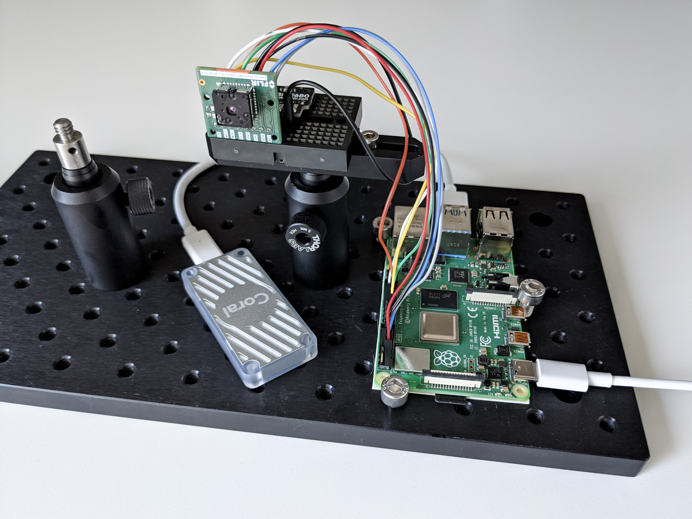
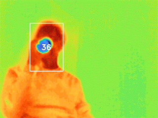

# Fever

**Fever** is a contactless fever thermometer with auto-aim. It combines a thermal camera with face detection from the [**Thermal Face**](https://github.com/maxbbraun/thermal-face) project.

⚠️ ***This is an incomplete prototype. It is not a medical device. See [issues](https://github.com/maxbbraun/fever/issues) for remaining work.***

## Parts

| Part | Info | Price (2020) |
| :- | :- | -: |
| FLIR Lepton 3.5 | Thermal camera module ([docs](https://groupgets.com/manufacturers/flir/products/lepton-3-5)) | [$199.00](https://www.digikey.com/product-detail/en/flir-lepton/500-0771-01/500-0771-01-ND/7606616) |
| PureThermal Mini | Thermal camera dev board ([docs](https://groupgets.com/manufacturers/getlab/products/purethermal-mini-flir-lepton-smart-i-o-module), [library](https://github.com/groupgets/purethermal1-uvc-capture#uvc-radiometrypy)) | [$99.00](https://www.digikey.com/product-detail/en/groupgets-llc/PURETHERMAL-M/2077-PURETHERMAL-M-ND/9866289) |
| BME680 Breakout Board | Ambient temperature, pressure, and humidity sensor ([library](https://github.com/pimoroni/bme680-python)) | [$23.95](https://www.sparkfun.com/products/15743) |
| Raspberry Pi 4 Model B | Tiny computer ([docs](https://www.raspberrypi.org/products/raspberry-pi-4-model-b/)) | [$35.00](https://www.raspberrypi.org/products/raspberry-pi-4-model-b/)
| Coral USB Accelerator | Edge TPU for faster face detection ([docs](https://coral.ai/docs/accelerator/get-started/), [library](https://github.com/google-coral/edgetpu)) | [$59.99](https://coral.ai/products/accelerator/) |



## Setup

Image [Raspbian](https://www.raspberrypi.org/downloads/raspbian/) and use `sudo raspi-config`:
- `Network Options > Wi-fi`
- `Boot Options > Desktop / CLI > Console Autologin`
- `Interfacing Options > SSH`
- `Interfacing Options > SPI`
- `Interfacing Options > I2C`

Enable access to the thermal camera over [UVC](https://en.wikipedia.org/wiki/USB_video_device_class):
```bash
cd /tmp

git clone https://github.com/groupgets/libuvc
cd libuvc
mkdir build
cd build
cmake ..
make
sudo make install

sudo sh -c "echo 'SUBSYSTEMS==\"usb\", ATTRS{idVendor}==\"1e4e\", ATTRS{idProduct}==\"0100\", SYMLINK+=\"pt1\", GROUP=\"usb\", MODE=\"666\"' >> /etc/udev/rules.d/99-pt1.rules"

```

## Install

```bash
cd

echo "deb https://packages.cloud.google.com/apt coral-edgetpu-stable main" | sudo tee /etc/apt/sources.list.d/coral-edgetpu.list
curl https://packages.cloud.google.com/apt/doc/apt-key.gpg | sudo apt-key add -

sudo apt-get update
sudo apt-get install -y python3-venv python3-opencv
sudo apt-get install -y libedgetpu1-max python3-edgetpu
sudo apt-get install -y libatlas-base-dev libjasper-dev libhdf5-dev libqt4-dev
sudo apt-get install -y git

python3 -m venv venv
. venv/bin/activate
pip3 install --no-cache-dir tensorflow
pip3 install opencv-contrib-python
pip3 install numpy absl-py Pillow
pip3 install smbus2 bme680
pip3 install https://dl.google.com/coral/python/tflite_runtime-2.1.0.post1-cp37-cp37m-linux_armv7l.whl
```

```bash
git clone https://github.com/maxbbraun/fever.git
cd fever

curl -O https://raw.githubusercontent.com/maxbbraun/thermal-face/master/models/thermal_face_automl_edge_fast_edgetpu.tflite
```

## Run

```bash
cd ~/fever

. venv/bin/activate
export LD_PRELOAD=/usr/lib/arm-linux-gnueabihf/libatomic.so.1
export PYTHONPATH=$PYTHONPATH:/usr/lib/python3/dist-packages
```

```bash
python fever.py --verbosity=1

Ambient temperature: 25 °C
Ambient pressure: 1010 hPa
Ambient humidity: 47 %
2 people
35 °C
34 °C
Frame took 83 ms (12.05 Hz)
Ambient temperature: 25 °C
Ambient pressure: 1010 hPa
Ambient humidity: 48 %
2 people
35 °C
34 °C
Frame took 87 ms (11.43 Hz)
...
```

## Visualize

```bash
python fever.py --visualize
```



## Flags

```bash
$ python fever.py --help

       USAGE: fever.py [flags]
flags:

fever.py:
  --[no]detect: Whether to run face detection.
    (default: 'true')
  --[no]display_metric: Whether to display metric units.
    (default: 'true')
  --face_confidence: The confidence threshold for face detection.
    (default: '0.5')
    (a number)
  --face_model: The TF Lite face detection model file compiled for Edge TPU.
    (default: 'thermal_face_automl_edge_fast_edgetpu.tflite')
  --max_num_faces: The maximum supported number of faces detected per frame.
    (default: '10')
    (an integer)
  --max_temperature: The maximum expected body temperature in centikelvin.
    (default: '31815')
    (an integer)
  --min_temperature: The minimum expected body temperature in centikelvin.
    (default: '29815')
    (an integer)
  --[no]visualize: Whether to visualize the thermal image.
    (default: 'false')

Try --helpfull to get a list of all flags.
```
