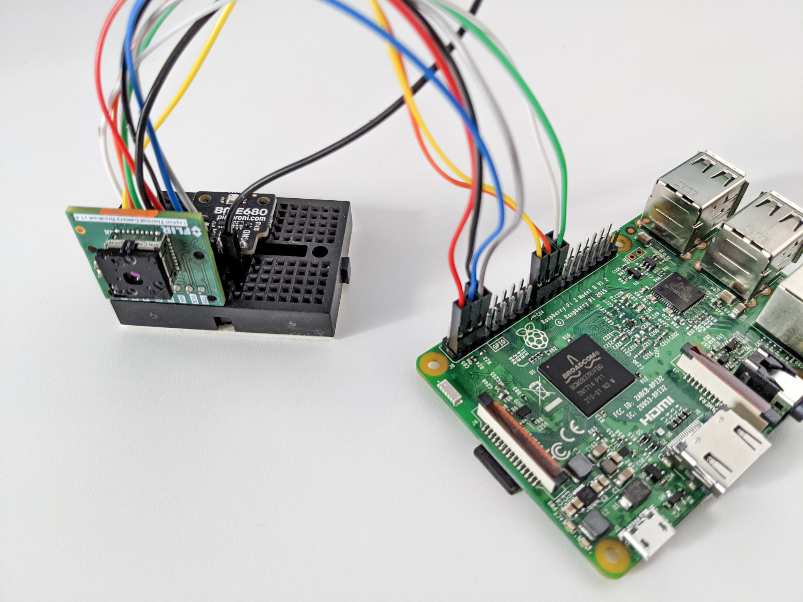
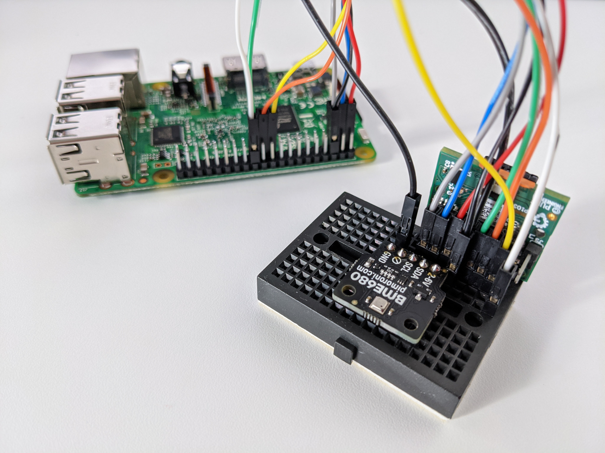

# FEVER

A contactless fever thermometer with auto-aim. Combines a thermal camera with face detection and uses ambient sensors for calibration.

## Parts

- [FLIR Radiometric Lepton Dev Kit V2](https://www.sparkfun.com/products/15948) (thermal camera)
- [BME680 Breakout Board](https://www.sparkfun.com/products/15743) (ambient temperature, pressure, and humidity sensor)
- [Raspberry Pi Zero W](https://www.sparkfun.com/products/14277) (or similar)

## Assembly

[SparkFun FLIR Lepton Hookup Guide](https://learn.sparkfun.com/tutorials/flir-lepton-hookup-guide/all)




## Install

```
git clone https://github.com/maxbbraun/fever.git && cd fever
scp fever.py pi@<RASPBERRY_PI_IP>:/home/pi/
```

```
ssh pi@<RASPBERRY_PI_IP>
python3 -m venv venv && . venv/bin/activate
sudo apt-get install libatlas-base-dev libjasper-dev
pip3 install --no-cache-dir tensorflow
pip3 install opencv-contrib-python
pip3 install numpy absl-py cvlib
pip3 install smbus2 bme680
git clone https://github.com/groupgets/pylepton.git
```

## Run

```
ssh pi@<RASPBERRY_PI_IP>
. venv/bin/activate
export LD_PRELOAD=/usr/lib/arm-linux-gnueabihf/libatomic.so.1
python fever.py --verbosity=1
```

## Output

```
(...)
I0410 18:11:23.993699 1995587312 fever.py:55] Ambient temperature: 24 °C
I0410 18:11:23.994379 1995587312 fever.py:57] Ambient pressure: 1013 hPa
I0410 18:11:23.994970 1995587312 fever.py:59] Ambient humidity: 42 %
I0410 18:11:23.953286 1995587312 fever.py:87] 0 people
I0410 18:11:23.993699 1995587312 fever.py:55] Ambient temperature: 24 °C
I0410 18:11:23.994379 1995587312 fever.py:57] Ambient pressure: 1013 hPa
I0410 18:11:23.994970 1995587312 fever.py:59] Ambient humidity: 42 %
I0410 18:11:25.208623 1995587312 fever.py:85] 1 person
I0410 18:11:25.210044 1995587312 fever.py:94] 33 °C
(...)
```
