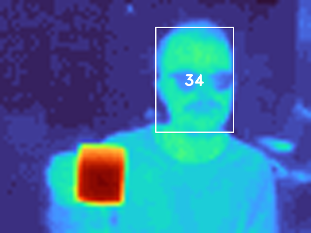
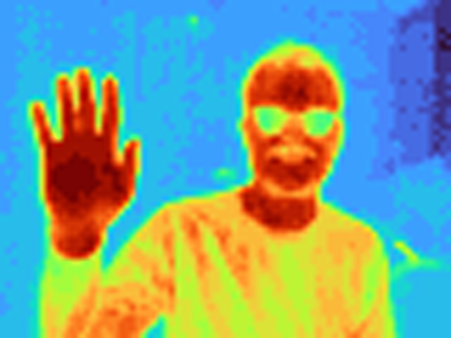

# Fever

**Fever** is a contactless fever thermometer with auto-aim. It combines a thermal camera with face detection.

⚠️ ***This is an incomplete prototype. It is not a medical device. See [issues](https://github.com/maxbbraun/fever/issues) for remaining work.***

## Parts

| Part | Info | Price (2020) |
| :- | :- | -: |
| FLIR Radiometric Lepton Dev Kit | Thermal camera ([docs](https://groupgets.com/manufacturers/flir/products/radiometric-lepton-2-5), [library](https://github.com/groupgets/pylepton)) | [$239.95](https://www.sparkfun.com/products/retired/14654) |
| BME680 Breakout Board | Ambient temperature, pressure, and humidity sensor ([library](https://github.com/pimoroni/bme680-python)) | [$23.95](https://www.sparkfun.com/products/15743) |
| Raspberry Pi 4 Model B (2 GB) | Tiny computer ([docs](https://www.raspberrypi.org/products/raspberry-pi-4-model-b/)) | [$35.00](https://www.sparkfun.com/products/15446)
| Coral USB Accelerator | Faster face detection ([docs](https://coral.ai/docs/accelerator/get-started/)) | [$59.99](https://coral.ai/products/accelerator/) |


## Setup

Image [Raspbian](https://www.raspberrypi.org/downloads/raspbian/) and use `sudo raspi-config`:
- `Network Options > Wi-fi`
- `Boot Options > Desktop / CLI > Console Autologin`
- `Interfacing Options > SSH`
- `Interfacing Options > SPI`
- `Interfacing Options > I2C`

## Install

```bash
git clone https://github.com/maxbbraun/fever.git && cd fever
scp fever.py pi@192.168.x.x:/home/pi/
```

```bash
ssh pi@192.168.x.x

echo "deb https://packages.cloud.google.com/apt coral-edgetpu-stable main" | sudo tee /etc/apt/sources.list.d/coral-edgetpu.list
curl https://packages.cloud.google.com/apt/doc/apt-key.gpg | sudo apt-key add -

sudo apt-get update
sudo apt-get install -y python3-venv python3-opencv
sudo apt-get install -y libedgetpu1-max python3-edgetpu
sudo apt-get install -y libatlas-base-dev libjasper-dev libhdf5-dev libqt4-dev
sudo apt-get install -y git

python3 -m venv venv && . venv/bin/activate
pip3 install --no-cache-dir tensorflow
pip3 install opencv-contrib-python
pip3 install numpy absl-py Pillow
pip3 install smbus2 bme680
pip3 install https://dl.google.com/coral/python/tflite_runtime-2.1.0.post1-cp37-cp37m-linux_armv7l.whl

git clone https://github.com/groupgets/pylepton.git
cd pylepton && python setup.py install && cd ..

curl -O https://raw.githubusercontent.com/maxbbraun/thermal-face/master/models/thermal_face_automl_edge_fast_edgetpu.tflite
```

## Run

```bash
ssh pi@192.168.x.x

. venv/bin/activate
export LD_PRELOAD=/usr/lib/arm-linux-gnueabihf/libatomic.so.1
export PYTHONPATH=$PYTHONPATH:/usr/lib/python3/dist-packages
```

```bash
python fever.py --verbosity=1

I0410 18:11:23.993699 1995587312 fever.py:55] Ambient temperature: 24 °C
I0410 18:11:23.994379 1995587312 fever.py:57] Ambient pressure: 1013 hPa
I0410 18:11:23.994970 1995587312 fever.py:59] Ambient humidity: 42 %
I0410 18:11:23.953286 1995587312 fever.py:87] 0 people
I0410 18:11:23.993699 1995587312 fever.py:55] Ambient temperature: 24 °C
I0410 18:11:23.994379 1995587312 fever.py:57] Ambient pressure: 1013 hPa
I0410 18:11:23.994970 1995587312 fever.py:59] Ambient humidity: 42 %
I0410 18:11:25.208623 1995587312 fever.py:85] 1 person
I0410 18:11:25.210044 1995587312 fever.py:94] 34 °C
...
```

## Visualize

|  |  |
| :-: | :-: |
| `python fever.py --visualize` | `python fever.py --visualize --nodetect` |

## Flags

```bash
$ python fever.py --help

       USAGE: fever.py [flags]
flags:

fever.py:
  --[no]detect: Whether to run face detection.
    (default: 'true')
  --[no]display_metric: Whether to display metric units.
    (default: 'true')
  --face_confidence: The confidence threshold for face detection.
    (default: '0.5')
    (a number)
  --face_model: The TF Lite face detection model file compiled for Edge TPU.
    (default: 'thermal_face_automl_edge_fast_edgetpu.tflite')
  --max_num_faces: The maximum supported number of faces detected per frame.
    (default: '10')
    (an integer)
  --max_temperature: The maximum temperature in centikelvin (for enhancing image contrast).
    (default: '37315')
    (an integer)
  --min_temperature: The minimum temperature in centikelvin (for enhancing image contrast).
    (default: '23715')
    (an integer)
  --[no]visualize: Whether to visualize the thermal image.
    (default: 'false')

Try --helpfull to get a list of all flags.
```
